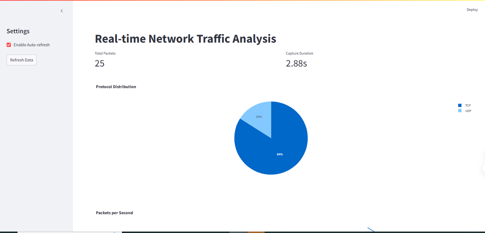

# Network Traffic Analysis Dashboard

## Overview

This project is a real-time network traffic analysis dashboard built using Streamlit, Scapy, and Plotly. It captures and processes network packets to provide insights into network traffic patterns, protocol usage, and packet sizes. The dashboard is designed for network monitoring, security analysis, and educational purposes.

## Purpose

The dashboard helps users:

- Monitor network traffic in real-time.
- Visualize protocol distribution, packet rates, and source IP addresses.
- Analyze network behavior for security and performance optimization.

## Installation

### Prerequisites

- Python 3.8 or higher
- Streamlit
- Scapy
- Plotly
- Pandas

### Installation Steps

```bash
pip install streamlit scapy plotly pandas
```

**Note:** Ensure you have administrative privileges to capture network packets.

## Usage

1. **Start the App:**

   ```bash
   streamlit run dashboard.py
   ```

2. **Packet Capture Control:**

   - **Start Capture:** Click the "Start Capture" button in the sidebar.
   - **Stop Capture:** Click the "Stop Capture" button in the sidebar.

3. **Auto-Refresh Feature:**

   - Enable auto-refresh by checking the "Enable Auto-refresh" option in the sidebar.
   - Manually refresh data by clicking the "Refresh Data" button.

## Features

- **Real-Time Packet Capture:** Captures network packets using Scapy.
- **Protocol Distribution:** Pie chart showing the distribution of protocols (ICMP, TCP, UDP).
- **Packets per Second:** Line chart displaying packet rates over time.
- **Top Source IPs:** Bar chart showing the top source IP addresses.
- **Recent Packets Table:** Displays the latest packets captured.
- **Auto-Refresh:** Automatically updates the dashboard at regular intervals.

## Data Processing

- **Packet Capture:** Uses Scapy's `sniff` function to capture packets.
- **Data Storage:** Stores packet data in a deque for efficient handling.
- **Data Conversion:** Converts packet data to a Pandas DataFrame for visualization.

## Technology Stack

- **Python:** Programming language.
- **Streamlit:** Framework for building web applications.
- **Scapy:** Library for packet manipulation and network discovery.
- **Plotly:** Library for interactive visualizations.
- **Pandas:** Library for data manipulation and analysis.

## Troubleshooting

- **Packet Capture Issues:** Ensure the script is run with administrative privileges.
- **Common Errors:** Check the terminal for error messages and refer to the documentation for solutions.

## Contributions

Contributions are welcome! To contribute:

1. Fork the repository.
2. Make changes.
3. Submit a pull request.

**Future Enhancements:**

- Support for additional protocols.
- Advanced filtering options.
- Historical data analysis.

## License

This project is licensed under the MIT License.

## Contact

For questions or feedback, please contact [Your Email Address] or open an issue on GitHub.

## Screenshots


